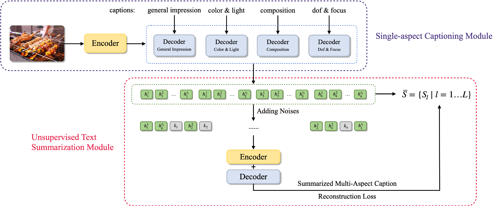

# Automatic Generation on Food Image Aesthetic Captioning

PyTorch implementation for paper [To be an Artist: Automatic Generation on Food
Image Aesthetic Captioning](https://ieeexplore.ieee.org/document/9288208) (ICTAI 2020).

Code is provided as-is, no updates expected.




&nbsp;

## Requirements

Make sure your environment is installed with:

- Python 3.5+
- java 1.8.0 (for computing METEOR and SPICE)

Then install requirements:

```bash
pip install -r requirements.txt
```


&nbsp;

## Usage

### Configuration

Hyperparameters and options can be configured in [`config.py`](config.py), see this file for more details.

### Preprocess

Preprocess the images along with their captions and store them locally:

```bash
python preprocess.py
```

### Single-Aspect Captioning Module

Single-Aspect Captioning Module is guaranteed to generate the captions and learn the feature representations of each aesthetic attribute.

To run **train**:

```bash
python single_train.py
```

To run **test** and compute metrics, edit `beam_size` in [`single_test.py`](single_test.py), then:

```bash
python single_test.py
```

To run **inference**, edit `image_path` and `beam_size` in [`single_infer.py`](single_infer.py), then:

```bash
python single_infer.py
```

### Multi-Aspect Captioning Module

Multi-Aspect Captioning Module is supposed to study the associations among all feature representations and automatically aggregate captions of all aesthetic attributes to a final sentence.

To run **train**:

```bash
python multi_train.py
```

To run **test** and compute metrics, edit `model_path` and `multi_beam_k` in [`multi_test.py`](multi_test.py), then:

```bash
python multi_test.py
```

To run **inference**, edit `image_path` and `multi_beam_k` in [`multi_infer.py`](multi_infer.py), then:

```bash
python multi_infer.py
```


&nbsp;

## Dataset

A dataset for food image aesthetic captioning was constructed to evaluate the proposed method, see [here](data) for details.


&nbsp;

## NOTES

- Followed the experiment settings in [a previous work](https://openaccess.thecvf.com/content_ICCV_2017/papers/Chang_Aesthetic_Critiques_Generation_ICCV_2017_paper.pdf), we pre-trained our single-aspect captioning module on the MSCOCO image captioning dataset first, and then fine-tuned on our dataset.
- The `load_embeddings` method (in [`src/utils/embedding.py`](src/utils/embedding.py)) will try to create a cache for loaded embeddings under folder `dataset_output_path`. This dramatically speeds up the loading time the next time.
- You will first need to download the [Stanford CoreNLP 3.6.0](http://stanfordnlp.github.io/CoreNLP/index.html) code and models for use by SPICE. To do this, run: `cd src/metrics && bash get_stanford_models.sh`.


&nbsp;

## Acknowledgements

- Implementation of single-aspect captioning module is based on [sgrvinod/a-PyTorch-Tutorial-to-Image-Captioning](https://github.com/sgrvinod/a-PyTorch-Tutorial-to-Image-Captioning).
- Implementation of multi-aspect captioning module is based on [zphang/usc_dae](https://github.com/zphang/usc_dae).
- Implementation of [evaluation metrics](src/metrics) is adopted from [ruotianluo/coco-caption](https://github.com/ruotianluo/coco-caption).
